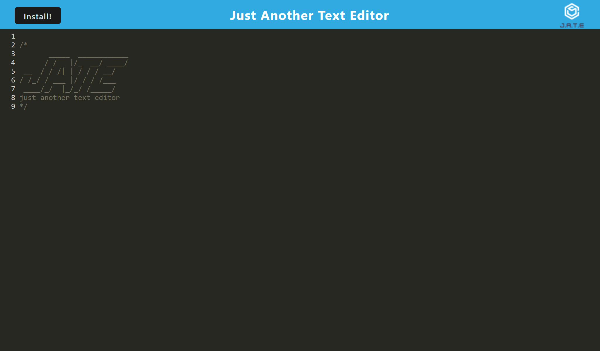
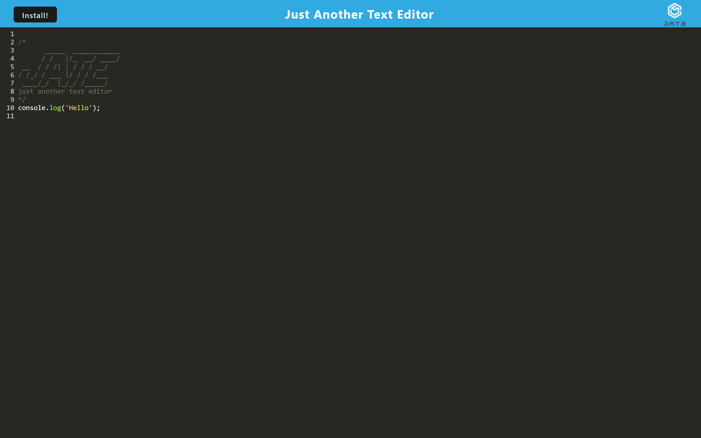
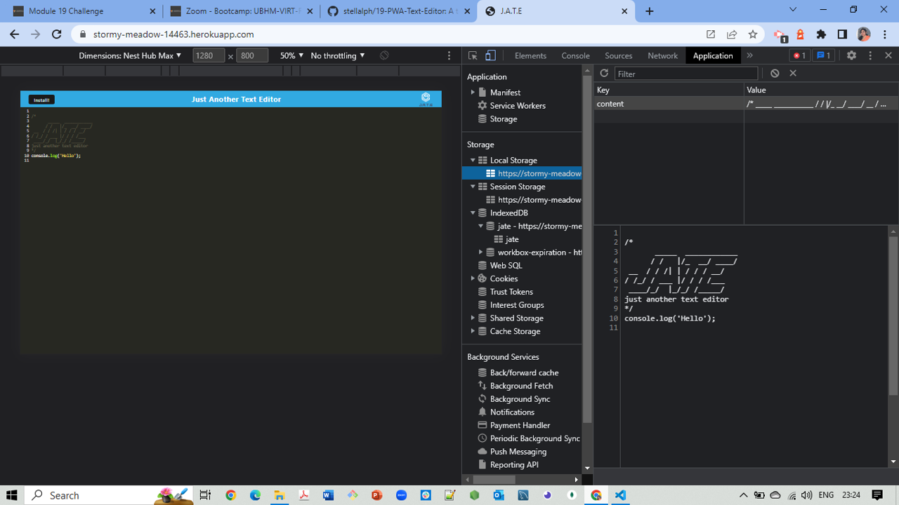
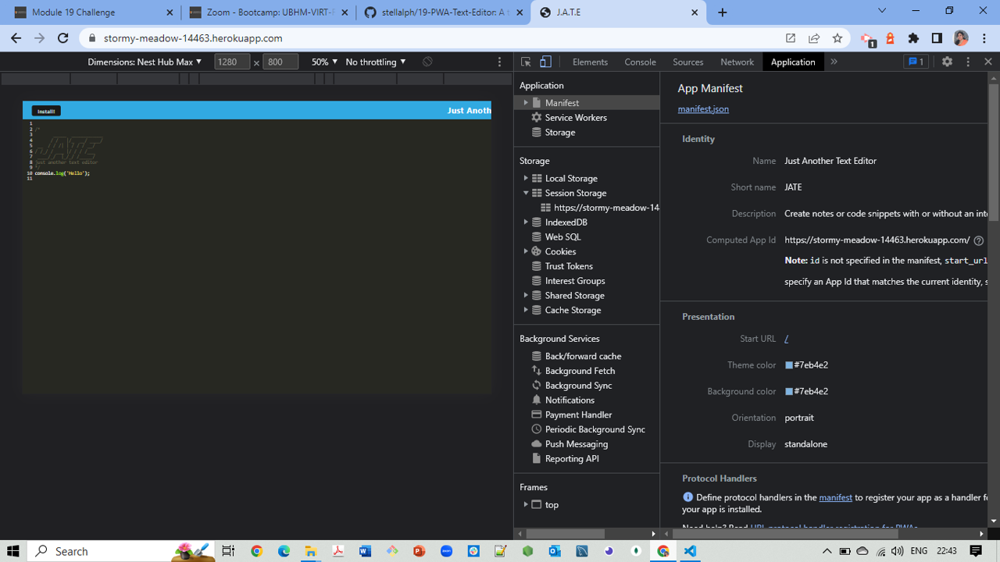
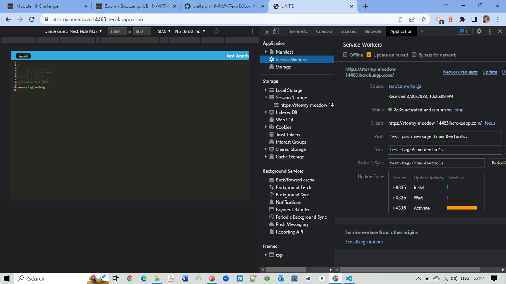

# Project Title: Text Editor PWA

## Description:
 This application can create notes or code snippets with or without an internet connection. Therefore, it retrieves these notes for later use.

## Installation:

This text editor relies on several methods and is built by storing the data on an IndexedDB database.

This application requires the Node.js and various Node Package Manager (npm) packages.

 The npm is places the modules for the node project and manages dependency conflicts. It is initialized using npm init. The package.json contains the user-input application details.

This application uses the following npm packages:-

  * express (express.js)
  * dev webpack (Webpack)
  * webpack-dev-server --save-dev (webpack-dev-server)
  * dev webpack-pwa-manifest (WebpackPwaManifest)
  * babel (Babel)
  * dev css-loader (CSS-loader)
  * install idb (IndexedDB)

These modules are bundled in the package.json. 

## Usage:

A client server folder structure appears upon opening the text editor application. The application starts up in the backend and serves the client upon running the `npm run start` from the root directory. Runing the text editor application from a terminal bundles up the JavaScript files using a webpack and running the webpack plugins generates an HTML file, service worker, and a manifest file. The next-gen JavaScript in my application enables the text editor to function in the browser without errors. 

An IndexedDB is immediately created a database storage, upon opening the text editor. The content in the text editor has been saved with IndexedDB, upon entering the content and clicking off in the DOM window
 
The text editor content gets retrieved from our IndexedDB upon reopening the text editor. Clicking the install button will download my web application as an icon on my desktop. Loading this web application needs a registered workbox service worker.
A registered service worker should have access to pre cached my static assets upon loading along with any subsequent pages and static assets. 

Deploying the application through Heroku should diploy the webpack application with proper build scripts.

Please see the screen shots below depicting the deployed application. 

 ### The heroku deployed application is: 
   https://stormy-meadow-14463.herokuapp.com/ 

   The following screenshots demonstrate the website application. 

   

   

   

   

   

## Credits:
  Thanks to Xander Rapstine (https://github.com/Xandromus) for providing rescources for this project.

## Questions?
  ### Reach me here: 
   My GitHub profile:   [veerak21](https://github.com/veerak21),

   My E-mail: pv.kallu@gmail.com.   